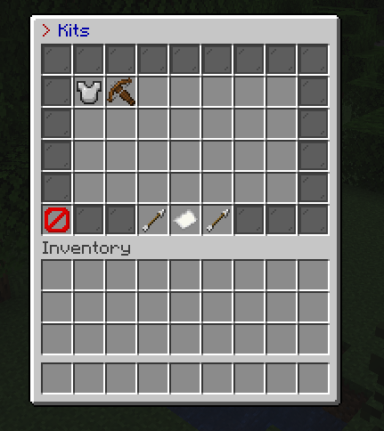
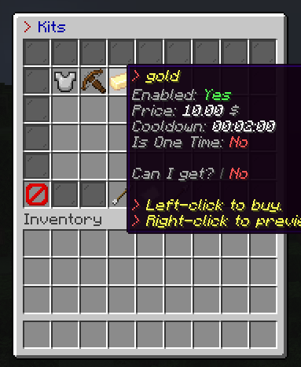
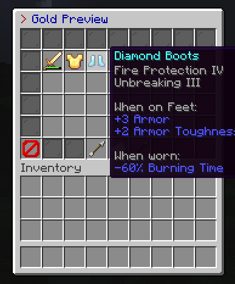

# OpenKits

OpenKits is a Minecraft plugin for easy kit creation, management, and distribution.

## Features

- Create and manage kits with custom items
- Set cooldowns, prices, and permissions for kits
- Localization support for multiple languages
- Integration with Vault for economy support
- GUI for easy kit management
- (TO-DO) PlaceholderAPI support for custom placeholders

## Installation

1. Download the latest release from the [releases page](https://github.com/TavstalDev/OpenKits/releases/latest).
2. Place the downloaded `.jar` file into your server's `plugins` directory.
3. Restart your server to generate the configuration files.

## Configuration

OpenKits generates a default configuration file on the first run. You can find it in the `plugins/OpenKits` directory. Edit the `config.yml` file to customize the plugin settings.

## Commands

- `/kit help` - Displays the help menu
- `/kit version` - Displays the plugin version
- `/kit reload` - Reloads the plugin configuration and localizations
- `/kit list` - Lists all available kits
- `/kit info [kit_name]` - Displays information about the specified kit
- `/kit [kit_name]` - Gives the specified kit to the player
- `/kit give [player] [kit_name]` - Gives the specified kit to the specified player
- `/kit create [kit_name] [icon_material] <cooldown> <price> <permission> <is_permission_required> <onetime>` - Creates a new kit
- `/kit delete [kit_name]` - Deletes the specified kit
- `/kit edit [kit_name]` - Edits the specified kit
- `/kit gui` - Opens the kit management GUI
- `/kit setcooldown [kit_name] [cooldown]` - Sets the cooldown for the specified kit
- `/kit setprice [kit_name] [price]` - Sets the price for the specified kit
- `/kit setpermission [kit_name] [permission] [is_permission_required]` - Sets the permission for the specified kit
- `/kit setonetime [kit_name] [is_onetime]` _ Sets the one-time flag for the specified kit
- `/kit setenabled [kit_name] [is_enabled]` - Enables or disables the specified kit
- `/kit setname [kit_name] [new_name]` - Sets the name for the specified kit
- `/kit seticon [kit_name] [item]` - Sets the icon for the specified kit
- `/kits <page>` - Lists all available kits

## Permissions

- `openkits.commands.kits` - Allows access to the `/kits` command
- `openkits.commands.kit` - Allows access to the `/kit` command
- `openkits.commands.kit.reload` - Allows reloading the plugin configuration
- `openkits.commands.kit.list` - Allows listing all available kits
- `openkits.commands.kit.info` - Allows showing information about a kit
- `openkits.commands.kit.give` - Allows giving a kit to a player
- `openkits.commands.kit.gui` - Allows opening the kit GUI
- `openkits.commands.kit.create` - Allows creating new kits
- `openkits.commands.kit.delete` - Allows deleting kits
- `openkits.commands.kit.edit` - Allows editing kits
- `openkits.commands.kit.setprice` - Allows setting the price of a kit
- `openkits.commands.kit.setcooldown` - Allows setting the cooldown of a kit
- `openkits.commands.kit.setpermission` - Allows setting the permission required to use a kit
- `openkits.commands.kit.setonetime` - Allows setting whether a kit can be used only once
- `openkits.commands.kit.setenabled` - Allows enabling or disabling a kit
- `openkits.commands.kit.setname` - Allows setting the name of a kit
- `openkits.commands.kit.seticon` - Allows setting the icon of a kit
- `openkits.player` - Collection of player permissions
    - `openkits.commands.kit`
    - `openkits.commands.kit.help`
    - `openkits.commands.kit.version`
    - `openkits.commands.kit.list`
    - `openkits.commands.kit.info`
    - `openkits.commands.kit.get`
    - `openkits.commands.kit.gui`
    - `openkits.commands.kits`
- `openkits.admin` - Collection of admin permissions
    - `openkits.commands.kit.reload`
    - `openkits.commands.kit.create`
    - `openkits.commands.kit.delete`
    - `openkits.commands.kit.edit`
    - `openkits.commands.kit.give`
    - `openkits.commands.kit.setname`
    - `openkits.commands.kit.setenabled`
    - `openkits.commands.kit.setprice`
    - `openkits.commands.kit.setcooldown`
    - `openkits.commands.kit.setpermission`
    - `openkits.commands.kit.setonetime`
    - `openkits.commands.kit.seticon`
- `openkits.*` - Gives all permissions related to the OpenKits plugin
    - `openkits.player`
    - `openkits.admin`

## Localization

OpenKits supports multiple languages. You can add or edit translations in the `plugins/OpenKits/lang` directory. The plugin will automatically load the appropriate language file based on the server's locale settings.

## Economy Integration

OpenKits integrates with Vault to provide economy support. Ensure that you have a compatible economy plugin installed and configured on your server.

## Screenshots

## Development

To contribute to the development of OpenKits, follow these steps:

1. Fork the repository on GitHub.
2. Clone your forked repository to your local machine.
3. Create a new branch for your feature or bugfix.
4. Make your changes and commit them to your branch.
5. Push your changes to your forked repository.
6. Create a pull request to the main repository.

## License

OpenKits is licensed under the GNU License. See the `LICENSE` file for more information.